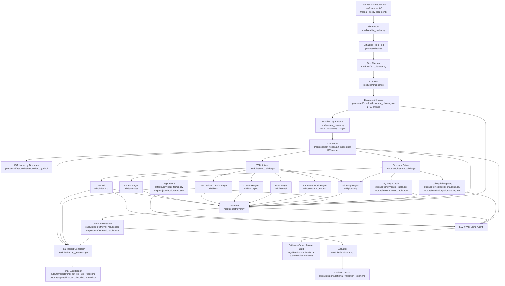
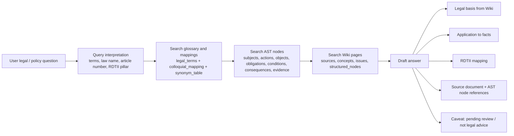

# AST + LLM Wiki Component Graph

Generated for the `legal_ast_llm_wiki` prototype.

This graph shows how the nine source documents move through the prototype pipeline and how an LLM can use the resulting Wiki to answer legal/policy questions with source traceability.

## Component Graph

## LLM Answering Flow

## Component Roles

| Component | Role | Main Output |
| --- | --- | --- |
| Raw documents | Original legal/policy source files | `raw/documents/` |
| File loader | Reads PDF, DOCX, TXT, MD, HTML without modifying originals | `processed/texts/` |
| Text cleaner | Conservative legal-text cleanup | cleaned text |
| Chunker | Splits documents into source-aligned legal/policy chunks | `document_chunks.json/csv` |
| AST parser | Converts chunks into AST-like legal structure nodes | `ast_nodes.json/csv` |
| Wiki builder | Converts AST nodes into Markdown LLM Wiki pages | `wiki/` |
| Glossary builder | Builds professional terms, colloquial mappings, synonyms | `outputs/csv/`, `outputs/json/`, `wiki/glossary/` |
| Retriever | Tests whether questions can retrieve terms, AST nodes, Wiki pages, and evidence | `retrieval_results.json/csv` |
| Evaluator | Compares raw chunk retrieval against AST + Wiki retrieval | `retrieval_validation_report.md` |
| Report generator | Summarizes build feasibility and outputs | final report Markdown/DOCX |
| LLM / Agent | Uses Wiki and AST evidence to answer questions | evidence-based answer draft |

## Current Prototype Status

| Metric | Current Value |
| --- | ---: |
| Source documents | 9 |
| Text chunks | 1769 |
| AST-like nodes | 1769 |
| Wiki pages | 1848 |
| Legal terms | 5690 |
| Colloquial mappings | 116 |
| Retrieval test questions | 8 |

## Important Caveat

All generated AST nodes, Wiki pages, glossary entries, mappings, and retrieval results remain candidate outputs with `review_status = pending`. The Wiki can support research-style and project-demo answers, but it should not be treated as a reviewed legal advice system.
